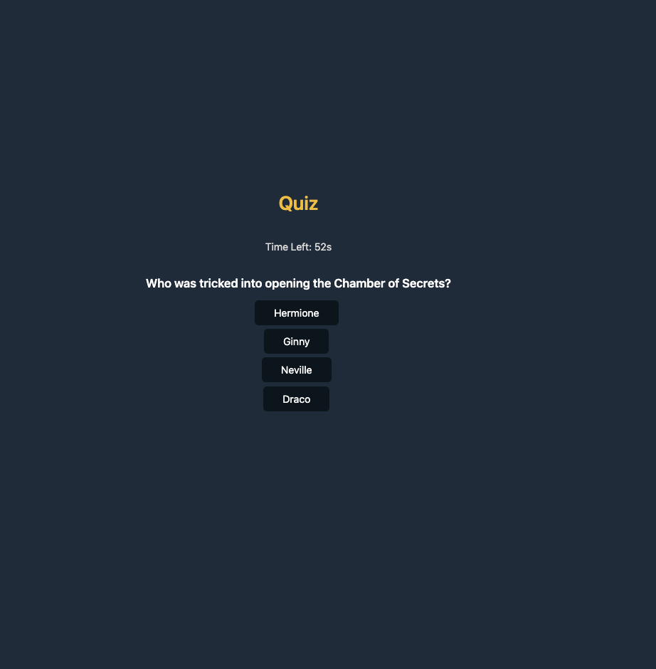

# quiz-game
## Description

This application is a quiz game over Harry Potter Trivia. The application uses HTML, CSS, and Javascript to achieve the following criteria:

 - a quiz game that shows one screen at a time, and one question at a time
 - a timer that begins when the quiz begins
 - a penalty that subtracts 15s from the timer when a question is answered incorrectly
 - an input screen at the end of the quiz that allows the user to enter in their initials to save their initials and score to local storage
 - a scoresheet that lists user initials and scores using local storage
 - an option to repeat the game at the end of the application

## Deployed Application

### URL
[Harry Potter Quiz](https://chesneyjulian.github.io/quiz-game/)
### Screenshot

## Usage
- Click the "Start Quiz" button to begin the quiz at the first question and start the timer at 60 seconds
- For each question, click the button corresponding to the answer choice to progress forwards
- For each incorrect answer, 15 seconds will be deducted from your timer and score
- After answering the last question or when the time is out, your score is shown with a place to enter in your initials
- Click the "Submit" button to save initials and score, and to view the scoresheet 
- Click the "Play Again" button to restart the timer and the quiz at the first question

## Resources
- Used [Water CSS](https://watercss.kognise.dev/) for simplified CSS styling
